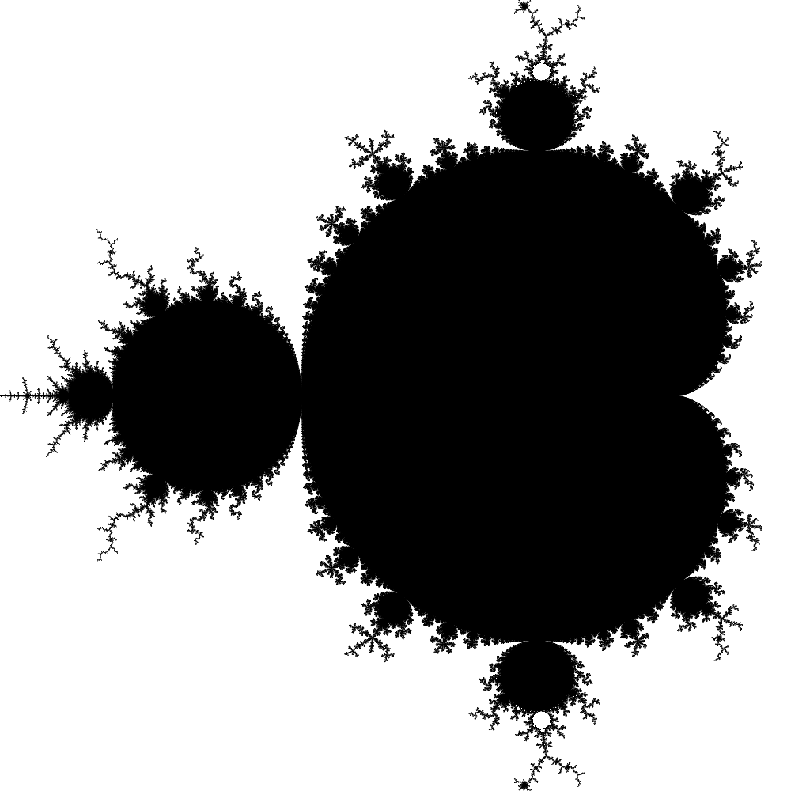

# multiman
A parallel Mandelbrot and Julia set-style fractal renderer supporting custom user expressions.
It leverages all available CPU cores to render images in parallel.

## Usage
```
multiman 0.1.0

USAGE:
    multiman <init> <iter> <width> <height> <output-path>

FLAGS:
    -h, --help       Prints help information
    -V, --version    Prints version information

ARGS:
    <init>           Initialization expression
    <iter>           Iteration expression
    <width>          Width of the image
    <height>         Height of the image
    <output-path>    Path of the resulting image
```

## Examples
```
multiman "(X / WIDTH * 2 - 1) + (Y / HEIGHT * 2 - 1.0) * i" "Z * Z + (0.1 + 0.65i)" 500 500 examples/1.png
```


```
multiman "0i" "Z * Z + (X * 2 / WIDTH - 1.5 + (Y * 2 / HEIGHT - 1) * i)" 500 500 examples/2.png
```
